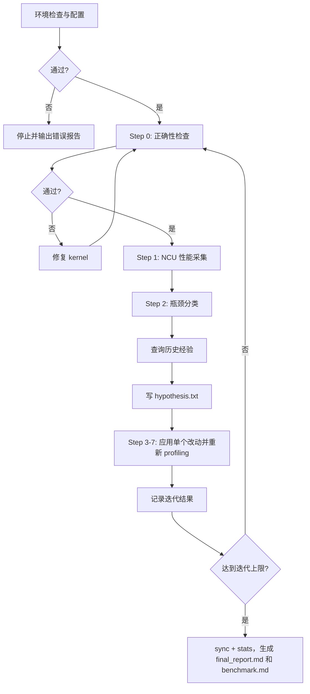

# kernel-opt-skill

面向 CUDA/Triton 的 kernel 瓶颈驱动优化 Skill。它用固定流程完成环境检查、正确性验证、Nsight Compute 指标采集、瓶颈分类、基于经验的单变量迭代、结果记录、最终报告和 PyTorch benchmark 对比。

[English](README.md)

## 环境要求

| 依赖项 | 版本要求 |
| --- | --- |
| NVIDIA GPU | Compute Capability 7.0+（Volta 及以上） |
| CUDA Toolkit | 11.6+（推荐 12.6+） |
| Nsight Compute | 2024.3.2+ |
| Python | 3.10+ |
| PyTorch | 2.0+ |
| nsight-python | 0.9.6+ |
| Triton | 2.0+ |

## 项目结构

```text
kernel-opt-skill/
├── skills/kernel-opt-skill/
│   ├── SKILL.md                  # 主入口，定义优化流程
│   ├── env/                      # 环境检查与 GPU 配置
│   ├── profiling/                # 正确性验证、NCU 采集与指标解读
│   ├── benchmark/                # solution 与 reference/PyTorch 横向对比
│   ├── experience/               # 策略指南、历史结果、推荐 CLI
│   ├── reference/                # hypothesis 规则与单变量迭代格式
│   └── report/                   # final_report 生成说明
└── demo/                         # CUDA/Triton 优化实战案例
```

## Skill 能做什么

该 Skill 把优化过程拆成证据驱动的闭环：

| 阶段 | 输出 | 作用 |
| --- | --- | --- |
| 环境检查与配置 | `env_check.md` | 检查 CUDA/PyTorch/Triton/ncu/nsight-python，并在 profiling 前锁定 GPU 时钟 |
| 正确性验证 | `v{n}/correctness.md` | kernel 错误时立即停止，避免分析无效性能数据 |
| NCU 采集 | `v{n}/ncu_summary.md`, `v{n}/ncu_details.md` | 收集 Speed of Light、memory、compute、occupancy、warp stall、branch divergence 等指标 |
| 瓶颈分类 | 来自 NCU 指标 | 判断 memory-bound、compute-bound、latency-bound 或 occupancy-bound |
| 经验查询 | `experience_log.py recommend` | 复用相似 kernel 上有效的策略，并避开已知失败路径 |
| 假设记录 | `v{n}/hypothesis.txt` | 明确本轮只改一个变量、依据是什么、预期哪些指标改善 |
| 迭代记录 | `experience_log.py add` | 持久化 success/failure/neutral 结果和关键指标 |
| 最终产物 | `final_report.md`, `benchmark.md` | 选出最佳版本，解释优化路径，并对比 PyTorch eager/compile |

Skill 内所有脚本路径都相对 skill 根目录：

```bash
SKILL_ROOT="/home/kernel-opt-skill/skills/kernel-opt-skill"
```

## 快速开始

调用 Skill，指定待优化的 kernel 文件、迭代次数和输出目录：

```text
/kernel-opt-skill 请帮我优化这个 kernel <kernel.cu>，迭代三次，输出到 <output_dir> 目录
```

也可以优化 Triton kernel：

```text
/kernel-opt-skill 请帮我优化这个 Triton kernel <kernel.py>，迭代五次，输出到 <output_dir> 目录
```

### CUDA / Triton 最小模板示例

#### CUDA（`.cu`）

> profiling 脚本会加载同名动态库并调用 `extern "C" void solve(...)`。

```cpp
#include <cuda_runtime.h>

__global__ void kernel(
    const float* in0, const float* in1, float* out, int n) {
    int i = blockIdx.x * blockDim.x + threadIdx.x;
    if (i < n) {
        out[i] = in0[i] + in1[i];
    }
}

extern "C" void solve(
    float* in0, float* in1, float* out, int n) {
    int threads = 256;
    int blocks = (n + threads - 1) / threads;
    kernel<<<blocks, threads>>>(in0, in1, out, n);
    cudaDeviceSynchronize();
}
```

#### Triton（`.py`）

> profiling 脚本要求定义 `setup(**kwargs)` 与 `run_kernel(**kwargs)`。

```python
import torch
import triton
import triton.language as tl

@triton.jit
def _kernel(
    x_ptr, y_ptr, out_ptr, n,
    BLOCK: tl.constexpr,
):
    pid = tl.program_id(axis=0)
    offs = pid * BLOCK + tl.arange(0, BLOCK)
    mask = offs < n
    x = tl.load(x_ptr + offs, mask=mask, other=0.0)
    y = tl.load(y_ptr + offs, mask=mask, other=0.0)
    tl.store(out_ptr + offs, x + y, mask=mask)

def setup(n=1024, seed=42, **kwargs):
    torch.manual_seed(seed)
    x = torch.randn((n,), device="cuda", dtype=torch.float32)
    y = torch.randn((n,), device="cuda", dtype=torch.float32)
    out = torch.empty((n,), device="cuda", dtype=torch.float32)
    return {
        "inputs": {"x": x, "y": y, "out": out, "n": n},
        "outputs": ["out"],
    }

def run_kernel(**kwargs):
    x, y, out = kwargs["x"], kwargs["y"], kwargs["out"]
    n = int(kwargs["n"])
    grid = lambda meta: (triton.cdiv(n, meta["BLOCK"]),)
    _kernel[grid](x, y, out, n, BLOCK=256)
```

#### Reference（`ref.py`）

> correctness/benchmark 会调用 `reference(**kwargs)` 作为基准实现。

```python
def reference(**kwargs):
    x = kwargs["x"]
    y = kwargs["y"]
    out = kwargs["out"]
    out.copy_(x + y)
```

触发后会执行以下优化循环：



### 输出目录结构

```text
<output_dir>/
├── ref.py
├── env_check.md
├── v0/
│   ├── v0.cu / v0.py
│   ├── correctness.md
│   ├── ncu_summary.md
│   ├── ncu_details.md
│   └── hypothesis.txt
├── v1/ ... / vN/              # 每次优化迭代一个目录
├── final_report.md
└── benchmark.md
```

`v0` 是初始实现，`v1` 到 `vN` 是连续的单变量优化版本；最大迭代次数一旦设定，运行中不再更改。

## 经验层

更新后的 Skill 通过 `experience/` 统一组织 CUDA 和 Triton 调优知识：

| 路径 | 作用 |
| --- | --- |
| `experience/cuda/CUDA.md` | 按 memory、compute、latency、occupancy 瓶颈组织 CUDA 优化策略 |
| `experience/triton/TRITON.md` | Triton 的 memory access、compute、pipelining、autotuning、launch/grid 策略 |
| `experience/learned/LEARNED.md` | 记录、查询、合并、同步、统计优化结果的规则 |
| `experience/learned/scripts/experience_log.py` | 提供 `add`、`recommend`、`search`、`list`、`merge`、`sync`、`stats` 的 CLI |
| `reference/hypothesis.md` | 强制使用 `Hypothesis / Rationale / Expected` 格式和单变量规则 |

在写下一版代码前，Skill 会先查询历史经验：

```bash
python $SKILL_ROOT/experience/learned/scripts/experience_log.py recommend \
  --kernel <kernel_type> --backend <cuda|triton> --chip <sm_XX> --bottleneck <type>
```

每轮结束后会记录 outcome；达到迭代上限后先执行 `sync` 和 `stats`，再生成 `final_report.md` 与 `benchmark.md`。

## 实战案例

完整优化过程（源码、NCU 指标、每轮 hypothesis、最终报告、benchmark）见 [demo/DEMO.md](demo/DEMO.md)。

| 案例 | 规模 | 最优版本 | 迭代 Speedup | 最优版本 vs PyTorch Eager |
| --- | --- | --- | ---: | --- |
| [Softmax (CUDA)](demo/DEMO.md#cuda-softmax) | N=4096, D=4096 | v2 | **11.72x** | 2.73x 快 |
| [GEMM (CUDA)](demo/DEMO.md#cuda-gemm) | M=K=N=1024 | v5 | **1.80x** | 0.37x（慢于 PyTorch/cuBLAS） |
| [MHA (CUDA)](demo/DEMO.md#cuda-mha) | N=512, d=1024, h=16 | v5 | **8.90x** | 0.47x（慢于 PyTorch） |
| [GEMM (Triton)](demo/DEMO.md#triton-gemm) | M=K=N=1024 | v5 | **1.02x** | 1.27x 快 |
| [MHA (Triton)](demo/DEMO.md#triton-mha) | N=1024, d=1024, h=16 | v5 | **731x** | 4.76x 快 |
| [Softmax (Triton)](demo/DEMO.md#triton-softmax) | N=1024, D=1024 | v0 | 1.00x（v0 已最优） | 1.88x 快 |