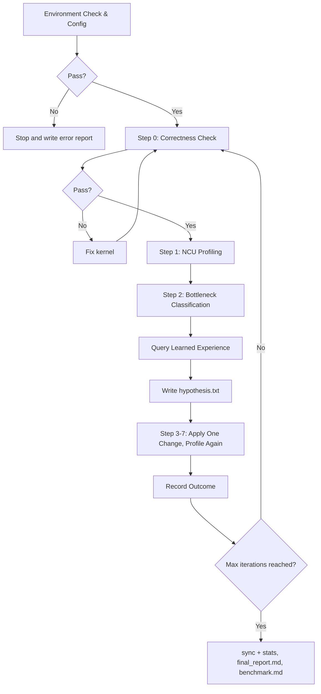

# kernel-opt-skill

A CUDA/Triton kernel optimization skill for bottleneck-driven kernel tuning. It runs environment checks, correctness validation, Nsight Compute profiling, bottleneck classification, experience-guided one-variable iterations, outcome logging, final reports, and PyTorch benchmark comparison.

[中文文档](README-zh.md)

## Requirements

| Dependency | Version |
| --- | --- |
| NVIDIA GPU | Compute Capability 7.0+ (Volta and above) |
| CUDA Toolkit | 11.6+ (12.6+ recommended) |
| Nsight Compute | 2024.3.2+ |
| Python | 3.10+ |
| PyTorch | 2.0+ |
| nsight-python | 0.9.6+ |
| Triton | 2.0+ |

## Project Structure

```text
kernel-opt-skill/
├── skills/kernel-opt-skill/
│   ├── SKILL.md                  # Entry point, defines the optimization loop
│   ├── env/                      # Environment check & GPU configuration
│   ├── profiling/                # Correctness, NCU collection & metric interpretation
│   ├── benchmark/                # Solution vs reference/PyTorch comparison
│   ├── experience/               # Strategy guides, learned outcomes, recommendation CLI
│   ├── reference/                # Hypothesis rules and one-variable iteration format
│   └── report/                   # final_report generation guide
└── demo/                         # CUDA/Triton optimization case studies
```

## What The Skill Does

The skill treats optimization as an evidence loop:

| Stage | Output | Purpose |
| --- | --- | --- |
| Environment check & config | `env_check.md` | Verify CUDA/PyTorch/Triton/ncu/nsight-python and lock GPU clocks before profiling |
| Correctness check | `v{n}/correctness.md` | Stop on incorrect kernels before collecting performance data |
| NCU profiling | `v{n}/ncu_summary.md`, `v{n}/ncu_details.md` | Collect Speed of Light, memory, compute, occupancy, warp stall, and divergence metrics |
| Bottleneck classification | Read from NCU metrics | Classify memory-bound, compute-bound, latency-bound, or occupancy-bound behavior |
| Experience query | `experience_log.py recommend` | Reuse successful past strategies and avoid known failures for similar kernels |
| Hypothesis | `v{n}/hypothesis.txt` | Record exactly one intended change, rationale, and expected metric movement |
| Iteration record | `experience_log.py add` | Persist success/failure/neutral results with metrics |
| Finalization | `final_report.md`, `benchmark.md` | Select the best version, summarize the optimization path, and compare with PyTorch eager/compile |

All script paths inside the skill are relative to the skill root:

```bash
SKILL_ROOT="/home/kernel-opt-skill/skills/kernel-opt-skill"
```

## Quick Start

Invoke the skill with your kernel file, iteration count, and output directory:

```text
/kernel-opt-skill Please optimize this kernel <kernel.cu>, run 3 iterations, output to <output_dir>
```

Triton kernels are supported as well:

```text
/kernel-opt-skill Please optimize this Triton kernel <kernel.py>, run 5 iterations, output to <output_dir>
```

### Minimal CUDA / Triton Templates

#### CUDA (`.cu`)

> Profiling scripts load the matching shared library and call `extern "C" void solve(...)`.

```cpp
#include <cuda_runtime.h>

__global__ void kernel(
    const float* in0, const float* in1, float* out, int n) {
    int i = blockIdx.x * blockDim.x + threadIdx.x;
    if (i < n) {
        out[i] = in0[i] + in1[i];
    }
}

extern "C" void solve(
    float* in0, float* in1, float* out, int n) {
    int threads = 256;
    int blocks = (n + threads - 1) / threads;
    kernel<<<blocks, threads>>>(in0, in1, out, n);
    cudaDeviceSynchronize();
}
```

#### Triton (`.py`)

> Profiling scripts require both `setup(**kwargs)` and `run_kernel(**kwargs)`.

```python
import torch
import triton
import triton.language as tl

@triton.jit
def _kernel(
    x_ptr, y_ptr, out_ptr, n,
    BLOCK: tl.constexpr,
):
    pid = tl.program_id(axis=0)
    offs = pid * BLOCK + tl.arange(0, BLOCK)
    mask = offs < n
    x = tl.load(x_ptr + offs, mask=mask, other=0.0)
    y = tl.load(y_ptr + offs, mask=mask, other=0.0)
    tl.store(out_ptr + offs, x + y, mask=mask)

def setup(n=1024, seed=42, **kwargs):
    torch.manual_seed(seed)
    x = torch.randn((n,), device="cuda", dtype=torch.float32)
    y = torch.randn((n,), device="cuda", dtype=torch.float32)
    out = torch.empty((n,), device="cuda", dtype=torch.float32)
    return {
        "inputs": {"x": x, "y": y, "out": out, "n": n},
        "outputs": ["out"],
    }

def run_kernel(**kwargs):
    x, y, out = kwargs["x"], kwargs["y"], kwargs["out"]
    n = int(kwargs["n"])
    grid = lambda meta: (triton.cdiv(n, meta["BLOCK"]),)
    _kernel[grid](x, y, out, n, BLOCK=256)
```

#### Reference (`ref.py`)

> correctness/benchmark calls `reference(**kwargs)` as the baseline implementation.

```python
def reference(**kwargs):
    x = kwargs["x"]
    y = kwargs["y"]
    out = kwargs["out"]
    out.copy_(x + y)
```

The optimization loop runs automatically:



### Output Structure

```text
<output_dir>/
├── ref.py
├── env_check.md
├── v0/
│   ├── v0.cu / v0.py
│   ├── correctness.md
│   ├── ncu_summary.md
│   ├── ncu_details.md
│   └── hypothesis.txt
├── v1/ ... / vN/              # one directory per optimization iteration
├── final_report.md
└── benchmark.md
```

`v0` is the initial implementation. `v1` through `vN` are successive one-variable iterations; the configured max iteration count is fixed once the run starts.

## Experience Layer

The updated skill routes CUDA and Triton tuning through `experience/`:

| Path | Role |
| --- | --- |
| `experience/cuda/CUDA.md` | CUDA strategies organized by memory, compute, latency, and occupancy bottlenecks |
| `experience/triton/TRITON.md` | Triton strategies for memory access, compute, pipelining, autotuning, and launch/grid choices |
| `experience/learned/LEARNED.md` | Rules for recording, querying, merging, syncing, and summarizing optimization outcomes |
| `experience/learned/scripts/experience_log.py` | CLI for `add`, `recommend`, `search`, `list`, `merge`, `sync`, and `stats` |
| `reference/hypothesis.md` | Required `Hypothesis / Rationale / Expected` format and one-variable rule |

Before writing code for a new version, the skill queries learned experience:

```bash
python $SKILL_ROOT/experience/learned/scripts/experience_log.py recommend \
  --kernel <kernel_type> --backend <cuda|triton> --chip <sm_XX> --bottleneck <type>
```

After each iteration, it records the outcome. At the end, it runs `sync` and `stats` before generating `final_report.md` and `benchmark.md`.

## Case Studies

Full optimization walkthroughs (source code, NCU metrics, per-iteration hypotheses, final reports, and benchmarks) are in [demo/DEMO.md](demo/DEMO.md).

| Case | Shape | Best Version | Iteration Speedup | Best Version vs PyTorch Eager |
| --- | --- | --- | ---: | --- |
| [Softmax (CUDA)](demo/DEMO.md#cuda-softmax) | N=4096, D=4096 | v2 | **11.72x** | 2.73x faster |
| [GEMM (CUDA)](demo/DEMO.md#cuda-gemm) | M=K=N=1024 | v5 | **1.80x** | 0.37x (slower than PyTorch/cuBLAS) |
| [MHA (CUDA)](demo/DEMO.md#cuda-mha) | N=512, d=1024, h=16 | v5 | **8.90x** | 0.47x (slower than PyTorch) |
| [GEMM (Triton)](demo/DEMO.md#triton-gemm) | M=K=N=1024 | v5 | **1.02x** | 1.27x faster |
| [MHA (Triton)](demo/DEMO.md#triton-mha) | N=1024, d=1024, h=16 | v5 | **731x** | 4.76x faster |
| [Softmax (Triton)](demo/DEMO.md#triton-softmax) | N=1024, D=1024 | v0 | 1.00x (v0 already best) | 1.88x faster |