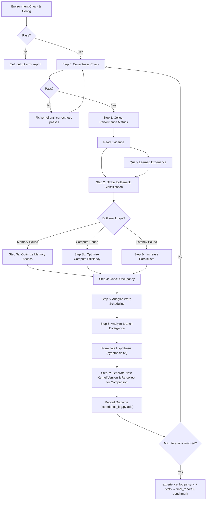

# kernel-opt-skill

**All script paths in this skill are relative to the skill root.** Set `SKILL_ROOT` to the skill directory before running commands:

```bash
SKILL_ROOT="<path-to-kernel-opt-skill>"
```

## Optimization Flow



---

## Routing

| Sub | Location | Responsibility |
|---|---|---|
| env | `env/ENV.md` | Required environment check (including Triton) + env configuration |
| profiling | `profiling/PROFILING.md` | Correctness check + NCU collection + metric interpretation + bottleneck classification |
| benchmark | `benchmark/BENCHMARK.md` | Lateral comparison of solution vs. reference framework (execution time + hardware metrics) |
| cuda | `experience/cuda/CUDA.md` | CUDA optimization experience (strategies by bottleneck type) |
| triton | `experience/triton/TRITON.md` | Triton optimization experience (strategies by bottleneck type) |
| report | `report/REPORT.md` | Generate optimization flow report |
| experience | `experience/EXPERIENCE.md` | Index of all accumulated experience: CUDA/Triton strategy guides, learned outcomes (see `experience/learned/LEARNED.md`) |
| reference | `reference/hypothesis.md` | Hypothesis formulation rules (one-variable rule, format, examples) |

---

## Optimization Loop

**All intermediate artifacts and kernel iterations are saved to `<output_dir>`. If not specified, defaults to the current directory `<./>`.**

**Default maximum iterations: `N=3`, user-configurable.**

Once the maximum iteration count `N` is set, it cannot be changed. `N+1` subdirectories are created under `<output_dir>`, each representing a different version:

```text
<output_dir>/
├── ref.py
├── env_check.md
├── v0/
│   ├── correctness.md
│   ├── ncu_summary.md
│   ├── ncu_details.md
│   ├── hypothesis.txt
│   └── v0.cu
├── v1/ … vN/                 ← one directory per optimization iteration
├── final_report.md
└── benchmark.md
```

`v0` is the initial unoptimized version; `v1`, `v2` ... `vN` are successive optimization iterations.

### Environment Check & Configuration (env)

* Environment check is a required step — **exit immediately on failure** and output problem details.
* Outputs `<output_dir>/env_check.md`, recording the environment baseline for CUDA/Triton kernel optimization. All subsequent environment queries use this file.

**Run:**
```bash
python $SKILL_ROOT/env/scripts/env_check.py -o <output_dir>/env_check.md [--gpu 0]
python $SKILL_ROOT/env/scripts/enc_config.py --gpu 0
```

### Step 0: Correctness Check (profiling)

* `ref.py` is the reference for correctness validation, typically a PyTorch implementation.
* Outputs `<output_dir>/v{n}/correctness.md`.
* If correctness check fails, inspect and fix the source code before proceeding.

**Run (CUDA):**
```bash
nvcc -shared -std=c++17 -arch=sm_90 -O3 -Xcompiler -fPIC -o kernel.so kernel.cu
python $SKILL_ROOT/profiling/script/correctness_check.py kernel.cu \
    --ref=ref.py --M=<M> --N=<N> --output-dir=<output_dir>/v0
```

**Run (Triton):**
```bash
python $SKILL_ROOT/profiling/script/correctness_check.py kernel.py \
    --ref=ref.py --M=<M> --N=<N> --output-dir=<output_dir>/v0 --backend=triton
```

### Step 1: Performance Metric Collection (profiling)

* Outputs `<output_dir>/v{n}/ncu_summary.md` and `<output_dir>/v{n}/ncu_details.md`, which record all metrics and serve as the basis for subsequent CUDA/Triton optimization decisions.

**Run:**
```bash
python $SKILL_ROOT/profiling/script/ncu_profile.py kernel.cu \
    --output-dir=<output_dir>/v0 --M=<M> --N=<N>
```

### Step 2: Global Bottleneck Classification (profiling & cuda)

* Classifies as `Memory-Bound`, `Compute-Bound`, or `Latency-Bound` based on NCU metrics, driving the next optimization direction for both CUDA and Triton implementations. See `profiling/PROFILING.md` for details.

### Step 3: Apply Bottleneck-Specific Optimization (cuda / triton)

Based on the bottleneck classification from Step 2, apply the matching strategy:

| Bottleneck | CUDA guide | Triton guide |
|---|---|---|
| Memory-Bound | `experience/cuda/CUDA.md` § Memory-Bound → `experience/cuda/reference/memory-opt.md` | `experience/triton/TRITON.md` § Memory-Bound → `experience/triton/reference/triton-opt.md` § Memory Access |
| Compute-Bound | `experience/cuda/CUDA.md` § Compute-Bound → `experience/cuda/reference/compute-opt.md` | `experience/triton/TRITON.md` § Compute-Bound → `experience/triton/reference/triton-opt.md` § Compute-level |
| Latency-Bound | `experience/cuda/CUDA.md` § Latency-Bound → `experience/cuda/reference/latency-opt.md` | `experience/triton/TRITON.md` § Latency-Bound → `experience/triton/reference/triton-opt.md` § Pipelining & Async |
| Occupancy-Bound | See Step 4 below | See Step 4 below |

**Do NOT write code yet.** First query past experience, then compose a hypothesis — see "Formulate Hypothesis" below. Only implement ONE change per iteration (one-variable rule).

### Step 4: Check Occupancy / Step 5: Analyze Warp Scheduling / Step 6: Analyze Branch Divergence (profiling & cuda)

* Determines optimization strategies based on NCU-collected `occupancy`, `warp scheduling`, and `branch divergence` metrics.

### Formulate Hypothesis (reference/hypothesis.txt)

**Before composing the hypothesis**, query past experience to bias toward strategies that worked and avoid those that failed:

```bash
python $SKILL_ROOT/experience/learned/scripts/experience_log.py recommend \
  --kernel <kernel_type> --backend <cuda|triton> --chip <sm_XX> --bottleneck <type>
```

Returns: past successes and failures for this context. Bias toward optimizations that already worked; avoid those marked as failures. Empty result → rely solely on the per-bottleneck strategy guides (`experience/cuda/CUDA.md`, `experience/triton/TRITON.md`).

Then compose a hypothesis **before writing any code**. See `reference/hypothesis.md` for the one-variable rule, format specification, and examples for each bottleneck type (memory-bound, compute-bound, latency-bound, occupancy-bound).

Write to `<output_dir>/v{n}/hypothesis.txt`. Only after writing the hypothesis, proceed to code generation.

### Step 7: Generate Next Kernel Version & Re-collect for Comparison

* Creates subdirectory `<output_dir>/v{n}`, generates the next kernel version based on the hypothesis written in `hypothesis.txt`, and re-collects metrics for comparison.

### Record Outcome (experience)

Record every outcome immediately after the iteration. See `experience/learned/LEARNED.md` for the full command reference, flags, thresholds, and merge workflow.

### Select Best Version & Generate Report (report) & Benchmark (benchmark)

See `experience/learned/LEARNED.md` (sync + stats) and `report/REPORT.md` (final report) for the complete procedure.


---

## Architecture Quick Reference

| Feature | CC 7.x Volta/Turing | CC 8.x Ampere | CC 9.0 Hopper |
|---|---|---|---|
| Tensor Core | Gen 1/2 | Gen 3 | Gen 4 (FP8) |
| Shared Memory limit | 96 KB | 164 KB | 228 KB |
| L2 Cache | 6 MB | 40–80 MB | 50 MB |
| `cp.async` | ✗/Limited | ✓ | ✓ + TMA |
| L2 Persistence | ✗ | ✓ | ✓ |
| Thread Block Cluster | ✗ | ✗ | ✓ |
